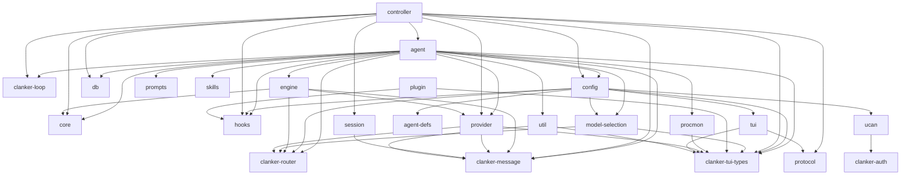

<!-- This file is auto-generated by `cargo xtask docs`. Do not edit. -->

⚡ Auto-generated from source. Run <code>cargo xtask docs</code> to refresh.

# Architecture Map

## Dependency graph

Workspace crate dependencies (auto-extracted from Cargo.toml files).

## Layers

### User interface

| Crate | Lines | Tests | Description |
|-------|------:|------:|-------------|
| `tui` | 16421 | 278 | Terminal UI (ratatui + crossterm) |
| `zellij` | 893 | 39 | Zellij integration and orchestration |

### Agent core

| Crate | Lines | Tests | Description |
|-------|------:|------:|-------------|
| `agent` | 6847 | 126 | Agent core — turn loop, event bus, tool interface, context management |
| `agent-defs` | 873 | 29 | Agent definition system (first-class) |
| `controller` | 7134 | 167 | Transport-agnostic session controller for agent orchestration. |

### LLM routing

| Crate | Lines | Tests | Description |
|-------|------:|------:|-------------|
| `provider` | 8107 | 158 | LLM provider abstraction |
| `model-selection` | 1483 | 49 | Multi-model routing policy |

### Infrastructure

| Crate | Lines | Tests | Description |
|-------|------:|------:|-------------|
| `protocol` | 2247 | 79 | Wire protocol types for daemon-client communication. |
| `session` | 3952 | 102 | Session persistence and tree management for agent conversations |
| `db` | 4361 | 154 | Embedded database (redb) for structured persistent storage. |
| `config` | 1702 | 43 | Configuration loading and path resolution for clankers. |

### Extensions

| Crate | Lines | Tests | Description |
|-------|------:|------:|-------------|
| `plugin` | 3725 | 39 | Plugin system (Extism WASM) |
| `skills` | 859 | 17 | Skills (markdown-based) |
| `hooks` | 1225 | 32 |  |

### Networking

| Crate | Lines | Tests | Description |
|-------|------:|------:|-------------|
| `matrix` | 1487 | 8 |  |

### Utilities

| Crate | Lines | Tests | Description |
|-------|------:|------:|-------------|
| `prompts` | 163 | 5 | Prompt templates Prompt template scanning and loading |
| `procmon` | 467 | 5 | Core process monitor for tracking child processes and resource usage. |
| `util` | 1924 | 79 | Shared utility functions for clankers. |

