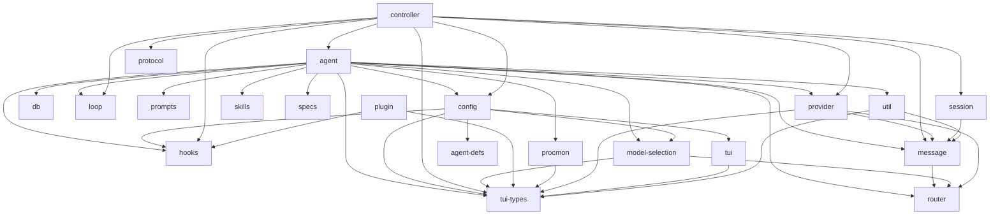

<!-- This file is auto-generated by `cargo xtask docs`. Do not edit. -->

⚡ Auto-generated from source. Run <code>cargo xtask docs</code> to refresh.

# Architecture Map

## Dependency graph

Workspace crate dependencies (auto-extracted from Cargo.toml files).

## Layers

### User interface

| Crate | Lines | Tests | Description |
|-------|------:|------:|-------------|
| `tui` | 18071 | 324 | Terminal UI (ratatui + crossterm) |
| `tui-types` | 1585 | 8 | Shared types for the clankers TUI crate boundary. |
| `zellij` | 892 | 39 | Zellij integration and orchestration |

### Agent core

| Crate | Lines | Tests | Description |
|-------|------:|------:|-------------|
| `agent` | 3971 | 78 | Agent core — turn loop, event bus, tool interface, context management |
| `agent-defs` | 872 | 29 | Agent definition system (first-class) |
| `controller` | 3534 | 89 | Transport-agnostic session controller for agent orchestration. |
| `loop` | 1417 | 46 | Iterative loop execution engine for clankers. |

### LLM routing

| Crate | Lines | Tests | Description |
|-------|------:|------:|-------------|
| `provider` | 1883 | 12 | LLM provider abstraction |
| `router` | 16472 | 303 | clankers-router — Model router and auth gateway for LLM providers |
| `model-selection` | 1477 | 49 | Multi-model routing policy |

### Infrastructure

| Crate | Lines | Tests | Description |
|-------|------:|------:|-------------|
| `actor` | 1270 | 27 | Lightweight native actor primitives for agent process trees. |
| `protocol` | 1279 | 28 | Wire protocol types for daemon-client communication. |
| `session` | 3902 | 101 | Session persistence and tree management for agent conversations |
| `db` | 3954 | 144 | Embedded database (redb) for structured persistent storage. |
| `config` | 792 | 17 | Configuration loading and path resolution for clankers. |

### Extensions

| Crate | Lines | Tests | Description |
|-------|------:|------:|-------------|
| `plugin` | 958 | 0 | Plugin system (Extism WASM) |
| `plugin-sdk` | 530 | 0 |  |
| `skills` | 168 | 5 | Skills (markdown-based) |
| `hooks` | 1160 | 32 |  |
| `specs` | 1638 | 40 | Spec-driven development (OpenSpec) |

### Networking

| Crate | Lines | Tests | Description |
|-------|------:|------:|-------------|
| `auth` | 2478 | 52 | Capability-based authorization for clankers agents. |
| `matrix` | 1485 | 8 |  |

### Utilities

| Crate | Lines | Tests | Description |
|-------|------:|------:|-------------|
| `message` | 866 | 25 | Message types for LLM agent conversations |
| `prompts` | 163 | 5 | Prompt templates Prompt template scanning and loading |
| `merge` | 1829 | 39 |  |
| `scheduler` | 736 | 28 | Cron-like scheduling engine for clankers. |
| `procmon` | 467 | 5 | Core process monitor for tracking child processes and resource usage. |
| `util` | 1920 | 79 | Shared utility functions for clankers. |

