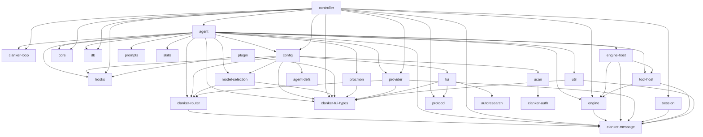

<!-- This file is auto-generated by `cargo xtask docs`. Do not edit. -->

⚡ Auto-generated from source. Run <code>cargo xtask docs</code> to refresh.

# Architecture Map

For the prompt/event/provider/session golden path, see [Request Lifecycle](../reference/request-lifecycle.md).

## Dependency graph

Workspace crate dependencies (auto-extracted from Cargo.toml files).

## Layers

### User interface

| Crate | Lines | Tests | Description |
|-------|------:|------:|-------------|
| `clanker-tui-types` | 1831 | 14 | Shared types for terminal-agent TUI boundaries. |
| `tui` | 16619 | 279 | Terminal UI (ratatui + crossterm) |
| `zellij` | 896 | 39 | Zellij integration and orchestration |
| `tts` | 1277 | 49 | clankers-tts — Multi-provider text-to-speech router |

### Agent core

| Crate | Lines | Tests | Description |
|-------|------:|------:|-------------|
| `clanker-message` | 882 | 25 | Message types for LLM agent conversations |
| `agent` | 8618 | 146 | Agent core — turn loop, event bus, tool interface, context management |
| `agent-defs` | 873 | 29 | Agent definition system (first-class) |
| `core` | 1643 | 42 |  |
| `engine` | 1481 | 29 | Host-facing reusable engine contracts for model/tool turn policy that compose alongside `clankers-core` through controller/agent adapter seams. |
| `controller` | 9244 | 210 | Transport-agnostic session controller for agent orchestration. |

### LLM routing

| Crate | Lines | Tests | Description |
|-------|------:|------:|-------------|
| `clanker-router` | 21649 | 382 | clanker-router — Model router and auth gateway for LLM providers |
| `provider` | 8613 | 168 | LLM provider abstraction |
| `model-selection` | 1501 | 49 | Multi-model routing policy |
| `prompts` | 163 | 5 | Prompt templates Prompt template scanning and loading |

### Infrastructure

| Crate | Lines | Tests | Description |
|-------|------:|------:|-------------|
| `config` | 1702 | 43 | Configuration loading and path resolution for clankers. |
| `db` | 6714 | 207 | Embedded database (redb) for structured persistent storage. |
| `hooks` | 1225 | 32 |  |
| `nix` | 1262 | 61 |  |
| `protocol` | 2240 | 79 | Wire protocol types for daemon-client communication. |
| `session` | 4014 | 102 | Session persistence and tree management for agent conversations |

### Networking & security

| Crate | Lines | Tests | Description |
|-------|------:|------:|-------------|
| `clanker-auth` | 1775 | 21 | UCAN-inspired capability tokens over iroh Ed25519 identity. |
| `matrix` | 1512 | 8 |  |
| `ucan` | 1436 | 52 | Clankers-specific capability tokens over clanker-auth generic infrastructure. |

### Extensions & tooling

| Crate | Lines | Tests | Description |
|-------|------:|------:|-------------|
| `clanker-plugin-sdk` | 524 | 0 | SDK for building [clankers](https://github.com/brittonr/clankers) WASM plugins. |
| `plugin` | 3725 | 39 | Plugin system (Extism WASM) |
| `skills` | 756 | 17 | Skills (markdown-based) |
| `procmon` | 468 | 5 | Core process monitor for tracking child processes and resource usage. |

### Utilities

| Crate | Lines | Tests | Description |
|-------|------:|------:|-------------|
| `util` | 1942 | 79 | Shared utility functions for clankers. |

