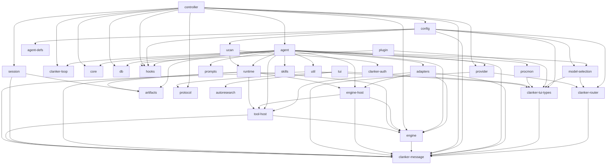

<!-- This file is auto-generated by `cargo xtask docs`. Do not edit. -->

⚡ Auto-generated from source. Run <code>cargo xtask docs</code> to refresh.

# Architecture Map

For the prompt/event/provider/session golden path, see [Request Lifecycle](../reference/request-lifecycle.md).

## Dependency graph

Workspace crate dependencies (auto-extracted from Cargo.toml files).

## Layers

### User interface

| Crate | Lines | Tests | Description |
|-------|------:|------:|-------------|
| `clanker-tui-types` | 1756 | 14 |  |
| `tui` | 16869 | 284 | Terminal UI (ratatui + crossterm) |
| `zellij` | 906 | 39 | Zellij integration and orchestration |
| `tts` | 1286 | 49 | clankers-tts — Multi-provider text-to-speech router |

### Agent core

| Crate | Lines | Tests | Description |
|-------|------:|------:|-------------|
| `clanker-message` | 1413 | 28 |  |
| `agent` | 14222 | 195 | Agent core — turn loop, event bus, tool interface, context management |
| `agent-defs` | 906 | 29 |  |
| `core` | 1693 | 42 |  |
| `engine` | 1966 | 34 | Host-facing reusable engine contracts for model/tool turn policy that compose alongside `clankers-core` through controller/agent adapter seams. |
| `controller` | 11552 | 233 | Transport-agnostic session controller for agent orchestration. |

### LLM routing

| Crate | Lines | Tests | Description |
|-------|------:|------:|-------------|
| `clanker-router` | 21981 | 385 | clanker-router — Model router and auth gateway for LLM providers |
| `provider` | 9694 | 180 | LLM provider abstraction |
| `model-selection` | 1524 | 49 | Multi-model routing policy |
| `prompts` | 174 | 5 | Prompt templates Prompt template scanning and loading |

### Infrastructure

| Crate | Lines | Tests | Description |
|-------|------:|------:|-------------|
| `config` | 3155 | 74 | Configuration loading and path resolution for clankers. |
| `db` | 7161 | 212 | Embedded database (redb) for structured persistent storage. |
| `hooks` | 1759 | 50 |  |
| `nix` | 1279 | 61 |  |
| `protocol` | 2247 | 79 | Wire protocol types for daemon-client communication. |
| `session` | 5027 | 111 | Session persistence and tree management for agent conversations |

### Networking & security

| Crate | Lines | Tests | Description |
|-------|------:|------:|-------------|
| `clanker-auth` | 1789 | 21 |  |
| `matrix` | 1527 | 8 |  |
| `ucan` | 4764 | 114 | Clankers-specific capability vocabulary and UCAN auth adapters. |

### Extensions & tooling

| Crate | Lines | Tests | Description |
|-------|------:|------:|-------------|
| `clanker-plugin-sdk` | 534 | 0 | SDK for building [clankers](https://github.com/brittonr/clankers) WASM plugins. |
| `plugin` | 3967 | 42 | Plugin system (Extism WASM) |
| `skills` | 773 | 17 | Skills (markdown-based) |
| `procmon` | 483 | 5 | Core process monitor for tracking child processes and resource usage. |

### Utilities

| Crate | Lines | Tests | Description |
|-------|------:|------:|-------------|
| `util` | 2509 | 87 | Shared utility functions for clankers. |

